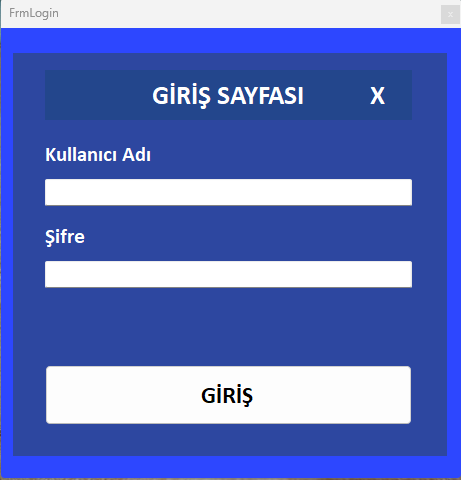
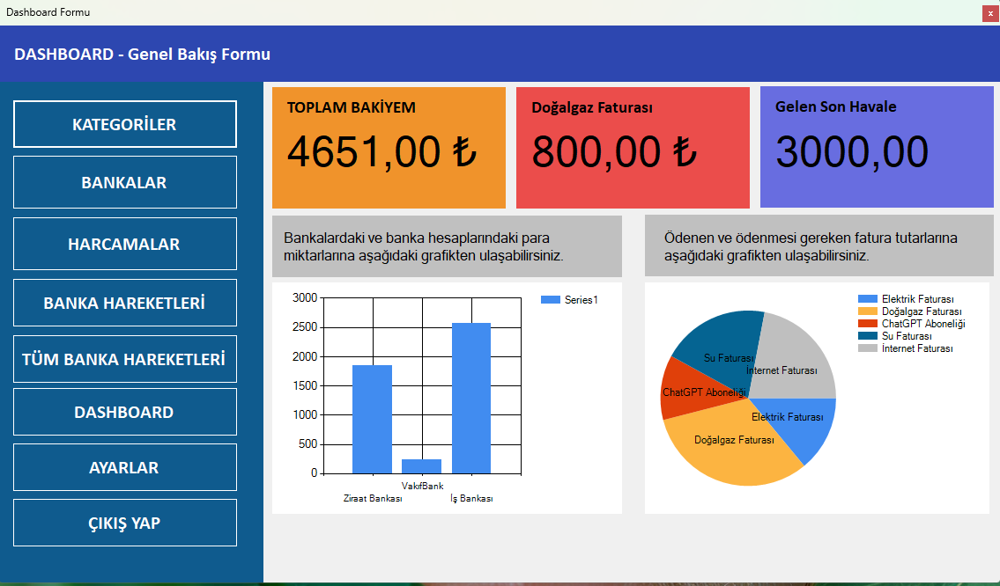
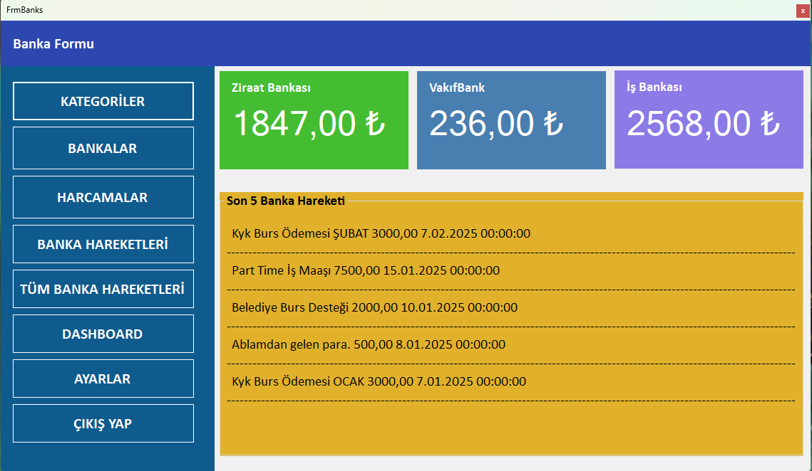

🎯 **Proje Adı:** Finansal CRM Uygulaması
📌 **Teknoloji:** Windows Forms (C#) + Entity Framework
📁 **Veritabanı:** SQL Server

---

### 📝 **Proje Tanımı**

Bu proje, küçük ve orta ölçekli işletmelerin **finansal işlemlerini yönetebileceği** bir CRM (Müşteri İlişkileri Yönetimi) uygulamasıdır. Kullanıcı dostu bir Windows Form arayüzü ile tüm **banka işlemleri, faturalar, harcamalar, kullanıcı ayarları** ve grafiksel analizler tek bir panelde toplanmıştır.

---

### 🛠️ **Kullanılan Teknolojiler**

* C# (.NET Framework)
* Windows Forms
* Entity Framework (Code First)
* SQL Server
* GDI+ (Grafikler için)

---

### 🧹 **Modül ve Form Açıklamaları**

#### 🔐 **FrmLogin**

* Kullanıcı girişi yapılır.
* Doğrulama kontrolleri mevcuttur.

#### 🏦 **allBankOperations**

* Sistemdeki tüm banka işlemleri listelenir.
* Filtreleme ve sıralama desteği.

#### 💰 **frmbanks**

* Hangi bankada ne kadar bakiye olduğu listelenir.
* Her banka için son 5 işlem görüntülenir.

#### 🧾 **FrmBilling**

* Fatura işlemleri gerçekleştirilir.
* **CRUD işlemleri** desteklenir.

#### 🗂️ **FrmCategories**

* Ödeme ve gider kategorileri tanımlanır.
* **CRUD işlemleri** yapılabilir.

#### 📊 **FrmDASHBOARD**

* Tüm verilerin genel bir özetini sunar:

  * **Toplam bakiye**
  * **Son gelen havale**
  * 2 Grafik içerir:

    1. Bankalardaki hesap bakiyeleri (Bar/Column grafik)
    2. Ödenen ve ödenecek fatura oranları (Pie chart)

#### 💸 **FrmExpenses**

* Tüm harcama kayıtları listelenir.

#### ⚙️ **FrmSettings**

* Kullanıcı tanımlama ve yönetimi (CRUD).
* Sistem ayarları yapılabilir.

---

### 📷 **Ekran Görüntüleri**

#### 🔐 Giriş Ekranı

#### 📊 Dashboard

#### 💸 Faturalar

## ve daha fazlası ...
---

### 🚀 **Kullanım Adımları**

1. Uygulama açıldığında giriş ekranı ile karşılaşılır.
2. Başarılı giriş sonrası dashboard ekranına yönlendirilirsiniz.
3. Menüden ilgili modüllere erişim sağlanır.
4. İşlem yapılan her modül Entity Framework ile veritabanına bağlanır.

---

### 🧪 **Test ve Güvenlik**

* CRUD işlemleri sırasında doğrulama kontrolleri yapılır.
* Giriş ekranında kullanıcı bilgileri doğrulanır.
* SQL Injection’a karşı güvenli Entity Framework kullanımı sağlanmıştır.

---

### 📍 **Geliştirici Notu**

Bu proje, gerçek dünya finansal yönetim senaryoları düşünülerek geliştirilmiştir. Amacım, **işletmelerin tüm finansal verilerini tek noktadan kolayca yönetebilmesini sağlamak**. Her öneri ve katkıya açığım.

---

### 👨‍💼 Geliştirici

**Ad Soyad:** \ ERENALP YILMAZ
**LinkedIn:** \ https://www.linkedin.com/in/erenalpylmaz
**GitHub:** \ https://github.com/ErenalpYilmaz
